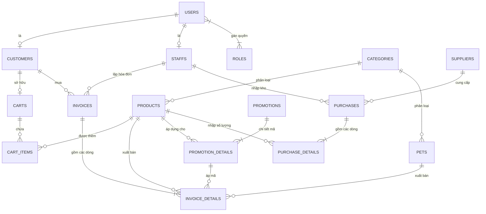

# 🐾 Happy Pet Shop - Hệ Thống Quản Lý & Bán Hàng Thú Cưng Toàn Diện

[](https://spring.io/projects/spring-boot)
[](https://openjdk.org/)
[](https://react.dev/)
[](https://www.typescriptlang.org/)
[](https://vitejs.dev/)
[](https://tailwindcss.com/)
[](https://openjfx.io/)
[](https://www.postgresql.org/)
[](https://redis.io/)
[-231F20.svg?logo=apachekafka)](https://kafka.apache.org/)
[](https://www.docker.com/)

---

## 📖 1. Giới Thiệu Dự Án (Overview)

**Happy Pet Shop** là một hệ sinh thái phần mềm hoàn chỉnh phục vụ cho chuỗi cửa hàng thú cưng, kết hợp giữa thương mại điện tử trực tuyến (E-commerce Web), ứng dụng bán hàng tại quầy (POS Desktop), và dịch vụ API xử lý nghiệp vụ trung tâm (Backend Core).

Dự án được xây dựng theo mô hình **Monorepo** với kiến trúc phân tầng chuyên nghiệp, hỗ trợ kiến trúc hướng sự kiện (**Event-Driven Architecture** với Apache Kafka), bộ nhớ đệm hiệu năng cao (**Redis Cache**), xác thực bảo mật đa tầng (**JWT HS512 & Google OAuth2**), và xử lý an toàn dữ liệu trong các kịch bản cạnh tranh tài nguyên (Race Condition Safe).

---

## 🏗️ 2. Cấu Trúc Dự Án (Repository Structure)

```text
happypetshop/
├── diagrams/                       # Tài liệu phân tích và thiết kế hệ thống
│   ├── HappyPetShop_Diagrams.drawio.xml   # Sơ đồ kiến trúc & phân tích (Draw.io)
│   ├── HappyPetShop_Diagrams.drawio.html  # Phiên bản xem trước Draw.io dạng Web
│   └── pgAdmin.pgerd                     # Thiết kế quan hệ thực thể (ERD) trong pgAdmin
│
├── server/                         # Phân hệ Backend API
│   └── happy-pet-shop/             # Ứng dụng Spring Boot Core
│       ├── compose.yaml            # Docker Compose chạy PostgreSQL, Redis, Kafka Cluster (3 nodes), Kafka UI
│       ├── Dockerfile              # Dockerfile Multi-stage build Eclipse Temurin 21
│       ├── pom.xml                 # Cấu hình Maven, MapStruct, Spring Security, Kafka, Redis...
│       └── src/
│           ├── main/java/com/funcoders/happy_pet_shop/
│           │   ├── configuration/  # Security, Redis, Kafka, OpenAPI/Swagger, OAuth2 handlers
│           │   ├── constant/       # Định nghĩa Enum (PaymentMethod, PaymentStatus, UserRole, Unit...)
│           │   ├── controller/     # 12 REST Controllers (Auth, Product, Pet, Invoice, Customer...)
│           │   ├── dto/            # Request & Response Data Transfer Objects
│           │   ├── entity/         # 18 JPA Entities (User, Pet, Product, Invoice, Purchase, Promotion...)
│           │   ├── exception/      # Bộ mã lỗi tập trung (ErrorType, AppException, GlobalExceptionHandler)
│           │   ├── kafka_consumer/ # Kafka Consumer lắng nghe message
│           │   ├── kafka_producer/ # Kafka Producer đẩy sự kiện giao dịch
│           │   ├── mapper/         # MapStruct Mappers cho ánh xạ Entity <-> DTO
│           │   ├── repository/     # Spring Data JPA Repositories & Custom Query Repositories
│           │   └── service/        # Business logic xử lý nghiệp vụ chính
│           └── main/resources/
│               └── application.yaml # File cấu hình môi trường, datasource, Redis, Kafka, JWT
│
├── my-app/                         # Phân hệ Frontend Web (Khách hàng & Quản trị viên)
│   ├── src/
│   │   ├── components/             # Reusable UI Components, Header, Footer, AdminSidebar...
│   │   ├── config/                 # apiConfig.ts (quản lý toàn bộ endpoint & storage keys)
│   │   ├── context/                # AuthContext (quản lý đăng nhập, session, vai trò)
│   │   ├── layouts/                # AdminLayout & UserLayout
│   │   ├── pages/
│   │   │   ├── admin/              # Trang quản trị: Dashboard, Products, Pets, Orders, Purchases, Promotions...
│   │   │   ├── user/               # Trang khách hàng: Products, Pets, Cart, Invoices, Review, Profile...
│   │   │   └── LoginPage/          # Đăng nhập & Đăng ký
│   │   ├── services/               # API Service layer (Axios) tích hợp với Backend & Cloudinary
│   │   └── types/                  # TypeScript Interfaces & Types định nghĩa dữ liệu chuẩn
│   ├── .env                        # Biến môi trường Vite (Cloudinary, Backend Base URL)
│   ├── package.json
│   └── vite.config.ts
│
└── happy-cashier-screen/           # Phân hệ Desktop POS dành cho Thu ngân (Point-of-Sale)
    ├── src/main/java/com/sgu/happycashierscreen/
    │   ├── controllers/            # CashierController, LoginController, HistoryController, AppNavigator
    │   ├── dto/                    # Request & Response DTOs
    │   ├── services/               # Tích hợp HTTP REST Client tới server Spring Boot
    │   └── util/                   # ApiClient, ObjectMapperUtil, URLUtil
    ├── src/main/resources/com/sgu/happycashierscreen/
    │   ├── cashier-view.fxml       # Màn hình thao tác bán hàng tại quầy
    │   ├── login-view.fxml         # Màn hình đăng nhập thu ngân
    │   ├── history-view.fxml       # Màn hình tra cứu lịch sử hóa đơn
    │   └── styles.css              # Giao diện CSS
    └── pom.xml                     # Cấu hình JavaFX 21, ControlsFX, BootstrapFX
```

---

## 🛠️ 3. Công Nghệ Sử Dụng (Tech Stack)

### 3.1. Backend (API Gateway & Core Service)
* **Ngôn ngữ & Nền tảng**: Java 21 (LTS).
* **Framework**: Spring Boot 4.0.1 / Spring Boot 3.x (`spring-boot-starter-web`, `spring-boot-starter-data-jpa`, `spring-boot-starter-validation`).
* **Bảo mật & Phân quyền**:
  * Spring Security 6 với cấu hình Stateless Session.
  * JWT (Nimbus JOSE + JWT) sử dụng thuật toán mã hóa chữ ký **HMAC-SHA512 (`HS512`)**.
  * Bảng `InvalidatedToken` lưu trữ danh sách đen (Blacklist) các token đã đăng xuất / bị thu hồi.
  * Tích hợp **Google Social Login (OAuth2 Client & OAuth2 Resource Server)**.
  * Kiểm soát quyền hạn chi tiết mức phương thức (`@EnableMethodSecurity`, `@PreAuthorize("hasAuthority('ROLE_ADMIN')")`).
* **Cơ sở dữ liệu & Tối ưu hóa**:
  * **PostgreSQL 17**: CSDL quan hệ chính. Sử dụng UUID cho Primary Key của tất cả thực thể, thiết lập Index tối ưu hóa truy vấn (`species`, `breed`, `status`, `customer_id`, `created_at`...).
  * **Check Constraint**: Ràng buộc toàn vẹn dữ liệu nghiêm ngặt ở mức DB (VD: `invoice_details` chỉ cho phép liên kết hoặc `product_id` hoặc `pet_id`).
  * **Concurreny & Race-condition Safe**: Xử lý tranh chấp trừ tồn kho nguyên tử bằng câu truy vấn native `decreaseQuantity` tránh bán âm sản phẩm khi có nhiều lượt mua cùng lúc.
* **Bộ nhớ đệm (Caching)**:
  * **Redis 8.0**: Kết nối thông qua Lettuce Pool.
  * Cấu hình `@EnableCaching` với `@Cacheable`, `@CachePut`, `@CacheEvict` trên các dịch vụ có tần suất truy vấn cao (`ProductService`, `CategoryService`, `UserService`), thời gian hết hạn (TTL) mặc định 10 phút với key-prefix `happypetshop:`.
* **Hệ thống hàng đợi & Sự kiện (Event-Driven Messaging)**:
  * **Apache Kafka 4.0.0**: Cụm cluster 3 broker chạy kiến trúc hiện đại **KRaft mode** (không cần Zookeeper).
  * `KafkaProducerService` & `KafkaConsumerService`: Bắn sự kiện mua hàng / biến động đơn hàng lên topic `pet-shop-topic` với định dạng `KafkaEvent` để các module tiêu thụ bất đồng bộ.
  * **Kafka UI**: Giao diện trực quan theo dõi Cluster, Broker, Topics, Consumers và Messages.
* **Tiện ích & Tài liệu hóa**:
  * **MapStruct 1.6.3** kết hợp **Lombok 1.18.32** tạo mapper DTO tự động tại compile time.
  * **SpringDoc OpenAPI 3 / Swagger UI** (v2.7.0): Tự động tạo tài liệu kiểm thử API trực quan có tích hợp nút Bearer Token Authorize.

### 3.2. Frontend Web (Khách Hàng & Quản Trị)
* **Core**: React 19, TypeScript 5.9, Vite 7.
* **Giao diện & Trải nghiệm (UI/UX)**: Tailwind CSS v4, Styled-components, bộ icon hiện đại Lucide React.
* **Điều hướng**: React Router DOM v6 với phân cấp layout rõ ràng:
  * `UserLayout`: Header, Navigation Bar, Cart Badge, Footer.
  * `AdminLayout`: Sidebar quản trị chuyên nghiệp, thống kê, breadcrumb.
* **Xử lý API & Trạng thái**:
  * Axios Client với bộ interceptor tự động chèn JWT Header vào mọi request.
  * Xử lý lỗi toàn cục qua `errorHandler.ts`.
  * `AuthContext`: Quản lý thông tin phiên làm việc, trạng thái đăng nhập và role.
* **Lưu trữ đa phương tiện**: Tích hợp **Cloudinary** upload ảnh trực tiếp từ client (Preset `happy-pet-shop`).

### 3.3. Desktop Application (Thu Ngân POS)
* **Framework**: JavaFX 21, FXML.
* **Thư viện UI**: ControlsFX, BootstrapFX, Hansolo TilesFX, Kordamp Ikonli.
* **Serialization**: Jackson Datatype JSR310 (xử lý LocalDateTime chuẩn ISO).
* **Kiến trúc Client**: Giao tiếp trực tiếp với Backend REST API qua `ApiClient` hỗ trợ đầy đủ luồng Xác thực -> Tìm kiếm sản phẩm -> Tạo đơn hàng -> Review khuyến mãi -> Xuất hóa đơn.

### 3.4. DevOps & Triển Khai
* Docker Multi-stage build tối ưu kích thước image Backend (Maven build -> JRE 21 runtime).
* Docker Compose điều phối hạ tầng phụ thuộc: PostgreSQL, Redis, Kafka Cluster (3 nodes), Kafka UI.

---

## 💎 4. Các Phân Hệ & Tính Năng Nổi Bật

### 🌐 4.1. Phân Hệ Khách Hàng (Customer Portal)
* **Trang chủ & Danh mục sản phẩm (`/user/products`)**: Hiển thị sản phẩm theo danh mục (Thức ăn, đồ chơi, phụ kiện, vệ sinh, chăm sóc...), hỗ trợ tìm kiếm và phân trang mượt mà.
* **Danh mục thú cưng (`/user/pets`)**: Tra cứu thú cưng theo giống loài (chó, mèo, hamster...), độ tuổi, giới tính, màu lông, nguồn gốc và trạng thái tiêm phòng vắc-xin.
* **Chi tiết sản phẩm (`/user/detailedProduct/:id`)**: Xem chi tiết mô tả, hình ảnh chất lượng cao, giá bán, đơn vị tính, số lượng còn trong kho và đánh giá từ khách hàng.
* **Giỏ hàng & Đặt hàng (`/user/cart`)**: Thêm, bớt số lượng, xóa sản phẩm, tính toán tạm tính và tự động kiểm tra số lượng tồn kho khả dụng.
* **Lịch sử & Chi tiết hóa đơn (`/user/invoices`, `/user/invoices/:invoiceId`)**: Theo dõi trạng thái đơn hàng (PENDING, PAID, CANCELLED...), địa chỉ nhận hàng, phương thức thanh toán và chi tiết từng mặt hàng.
* **Đánh giá & Nhận xét (`/user/review`)**: Gửi đánh giá cho các sản phẩm đã mua kèm phản hồi.
* **Quản lý tài khoản (`/user/profile`)**: Xem và cập nhật thông tin cá nhân, số điện thoại, địa chỉ nhận hàng mặc định.

### ⚙️ 4.2. Phân Hệ Quản Trị Viên (Admin Management Portal)
* **Dashboard Thống Kê (`/admin/dashBoard`)**: Tổng quan số lượng đơn hàng, doanh thu thực tế, khách hàng mới, sản phẩm trong kho và danh sách đơn hàng gần nhất.
* **Quản lý sản phẩm (`/admin/listProducts`)**: Thêm mới, chỉnh sửa, xóa mềm/ẩn sản phẩm; tải ảnh trực tiếp lên Cloudinary; thiết lập giá, đơn vị tính, hạn sử dụng, thương hiệu, xuất xứ.
* **Quản lý thú cưng (`/admin/pets`)**: Quản lý hồ sơ thú cưng, đánh dấu trạng thái "Đã bán" khi xuất chuồng, theo dõi thông tin tiệt trùng và tiêm chủng.
* **Quản lý danh mục (`/admin/manageProductCategory`)**: Quản lý cây phân loại sản phẩm.
* **Quản lý đơn hàng (`/admin/manageOrders`)**: Duyệt đơn, cập nhật trạng thái đơn hàng (PAID, CANCELLED, REFUNDED...).
* **Quản lý nhập hàng (`/admin/purchases`, `/admin/purchases/add`)**: Tạo phiếu nhập hàng từ Nhà cung cấp, tính toán tổng chi phí nhập, cập nhật tồn kho tự động.
* **Quản lý khuyến mãi (`/admin/promotions`, `/admin/promotions/add`)**: Thiết lập các chương trình ưu đãi, mã giảm giá (theo % hoặc số tiền cố định), thời gian hiệu lực và danh sách sản phẩm được áp dụng.
* **Quản lý khách hàng (`/admin/customers`)**: Quản lý hồ sơ khách hàng, tra cứu điểm tích lũy và điều chỉnh điểm thành viên.
* **Quản lý nhân viên (`/admin/staffs`)**: Quản lý danh sách nhân viên, phân bổ ca làm việc (Ca 1, Ca 2, Ca 3).
* **Quản lý nhà cung cấp (`/admin/suppliers`)**: Danh bạ đối tác cung cấp phụ kiện, thức ăn, con giống.

### 🖥️ 4.3. Phân Hệ Thu Ngân Tại Quầy (Cashier Desktop POS)
* **Đăng nhập ca làm việc**: Nhân viên thu ngân đăng nhập bằng tài khoản nội bộ.
* **Giao diện bán hàng tốc độ cao**:
  * Tìm kiếm nhanh sản phẩm theo từ khóa/tên.
  * Click chọn nhanh đưa vào giỏ hàng tại quầy.
  * Tùy chỉnh số lượng tức thì, cảnh báo hết hàng ngay trên màn hình.
  * Nhập mã định danh/SĐT khách hàng để tích lũy điểm thưởng.
  * Chức năng **Review Invoice**: Tự động tính toán chương trình khuyến mãi tốt nhất (`bestPromotionByProduct`) cho giỏ hàng trước khi xác nhận.
  * Hỗ trợ phương thức thanh toán: Tiền mặt tại quầy (`COD`) hoặc Quét mã QR chuyển khoản (`QR_Scanning`).
* **Lịch sử giao dịch tại quầy**: Tra cứu nhanh danh sách hóa đơn đã xuất trong ca làm việc.

---

## 📊 5. Thiết Kế Cơ Sở Dữ Liệu (Database Schema)

Hệ thống quản lý dữ liệu chặt chẽ qua 18 thực thể chính trong PostgreSQL:



### Các Bảng Dữ Liệu Nòng Cốt:
1. `users`: Thông tin người dùng cơ sở (họ tên, username, password đã hash BCrypt, email, sđt, địa chỉ, trạng thái).
2. `roles` & `user_roles`: Phân quyền người dùng (`ADMIN`, `STAFF`, `USER`).
3. `customers`: Mở rộng từ user, quản lý điểm tích lũy (`points`) và giỏ hàng cá nhân.
4. `staffs`: Mở rộng từ user, quản lý ca làm việc (`shift`: 1, 2, 3).
5. `categories`: Danh mục dùng chung cho sản phẩm và thú cưng.
6. `products`: Sản phẩm (tên, giá, đơn vị tính `Unit`, số lượng tồn kho `quantity`, thương hiệu, xuất xứ, hạn sử dụng, ảnh).
7. `pets`: Thú cưng (loài, giống, ngày sinh, giới tính, giá bán, màu sắc, tình trạng tiêm vắc-xin, tiệt trùng, cờ `available`).
8. `carts` & `cart_items`: Lưu trữ giỏ hàng trực tuyến của khách hàng.
9. `invoices` & `invoice_details`: Hóa đơn bán lẻ và chi tiết từng dòng hóa đơn (tự động tính chiết khấu `discountAmount` và tổng tiền thực thu `realAmount`).
10. `promotions` & `promotion_details`: Chiến dịch khuyến mãi (`PERCENT` hoặc `FIXED`), mã code ưu đãi, thời hạn bắt đầu/kết thúc.
11. `suppliers`: Nhà cung cấp hàng hóa.
12. `purchases` & `purchase_details`: Phiếu nhập hàng và chi tiết nhập kho.
13. `invalidated_tokens`: Bảng lưu token bị thu hồi khi người dùng Logout.

---

## 🚀 6. Hướng Dẫn Cài Đặt & Chạy Dự Án (Getting Started)

### 6.1. Yêu Cầu Môi Trường (Prerequisites)
* **Java Development Kit (JDK)**: Phiên bản 21 trở lên.
* **Apache Maven**: Phiên bản 3.9+ (hoặc dùng `mvnw` đi kèm).
* **Node.js**: Phiên bản 18 LTS hoặc 20 LTS trở lên & **pnpm** (hoặc npm).
* **Docker & Docker Compose**: Để khởi chạy PostgreSQL, Redis, Kafka Cluster.

---

### 6.2. Bước 1: Khởi Động Hạ Tầng Bằng Docker
Thư mục `server/happy-pet-shop/` đã có file `compose.yaml` sẵn sàng cấu hình:
* **PostgreSQL 17**: Port `5432`
* **Redis 8**: Port `6379`
* **Kafka KRaft 3 Brokers**: Node 1 (`9092`), Node 2 (`9093`), Node 3 (`9094`)
* **Kafka UI**: Port `8081`

Mở terminal và thực thi:
```bash
cd "server/happy-pet-shop"
docker compose up -d
```

Kiểm tra trạng thái các container:
```bash
docker compose ps
```
> [!TIP]
> Bạn có thể truy cập **Kafka UI** tại địa chỉ: [http://localhost:8081](http://localhost:8081) để theo dõi hoạt động của Kafka Cluster và các message trong topic `pet-shop-topic`.

---

### 6.3. Bước 2: Cấu Hình & Chạy Backend (Spring Boot)

#### 1. Thiết lập biến môi trường (Environment Variables):
Ứng dụng sử dụng các biến môi trường trong `application.yaml`. Thiết lập các biến môi trường trước khi chạy hoặc truyền vào khi khởi động:

```bash
export SPRING_DATASOURCE_URL="jdbc:postgresql://localhost:5432/happy_pet_shop"
export SPRING_DATASOURCE_USERNAME="postgres"
export SPRING_DATASOURCE_PASSWORD="root"
export JWT_KEY="DayLaKhoaBiMatRatDaiVaBaoMatDungChoThuatToanHMACSHA512PetShopHappy2026!#"
export GOOGLE_CLIENT_ID="your_google_client_id_optional"
export GOOGLE_CLIENT_SECRET="your_google_client_secret_optional"
```

#### 2. Build và khởi động Server:
```bash
cd "server/happy-pet-shop"

# Cài đặt dependency và build
./mvnw clean package -DskipTests

# Chạy ứng dụng
./mvnw spring-boot:run
```

* Backend sẽ khởi động tại: `http://localhost:8080/happy-pet-shop`
* **Tài liệu Swagger UI**: [http://localhost:8080/happy-pet-shop/swagger-ui/index.html](http://localhost:8080/happy-pet-shop/swagger-ui/index.html)
* **OpenAPI Docs JSON**: [http://localhost:8080/happy-pet-shop/v3/api-docs](http://localhost:8080/happy-pet-shop/v3/api-docs)

> [!NOTE]
> Khi khởi động lần đầu, `ApplicationRunnerImpl` sẽ tự động:
> 1. Tạo các Role mặc định: `ADMIN`, `USER`, `STAFF`.
> 2. Khởi tạo tài khoản Quản trị viên mặc định:
>    * Username: `admin`
>    * Password: `Asdf1234!`
> 3. Nạp sẵn 8 danh mục thú cưng mẫu (Food & Treats, Toys, Accessories, Grooming, Beds & Furniture...).

---

### 6.4. Bước 3: Cấu Hình & Chạy Frontend Web (React + Vite)

#### 1. Cấu hình biến môi trường:
Kiểm tra file `my-app/.env` (tạo mới nếu chưa có):
```env
VITE_BASE_URL=http://localhost:8080/happy-pet-shop
VITE_CLOUDINARY_CLOUD_NAME=dx8hyzdgo
VITE_CLOUDINARY_UPLOAD_PRESET=happy-pet-shop
```

#### 2. Cài đặt thư viện và khởi chạy:
```bash
cd "my-app"

# Cài đặt các gói dependency bằng pnpm (khuyến nghị) hoặc npm
pnpm install

# Khởi chạy máy chủ phát triển
pnpm dev
```

* Truy cập cổng mặc định: [http://localhost:5173](http://localhost:5173)
* Giao diện người dùng: [http://localhost:5173/user/products](http://localhost:5173/user/products)
* Giao diện quản trị: [http://localhost:5173/admin](http://localhost:5173/admin)

---

### 6.5. Bước 4: Chạy Phân Hệ Thu Ngân POS (JavaFX Cashier Screen)

Mở một cửa sổ dòng lệnh riêng:
```bash
cd "happy-cashier-screen"

# Khởi chạy ứng dụng JavaFX qua maven plugin
./mvnw clean javafx:run
```
* Màn hình đăng nhập sẽ xuất hiện. Đăng nhập bằng tài khoản nhân viên hoặc tài khoản `admin / Asdf1234!` để bắt đầu thực hiện bán hàng tại quầy.

---

## 📡 7. Danh Sách REST API Endpoints Chính

| Phân Hệ | Method | Endpoint | Quyền Hạn | Mô Tả |
| :--- | :--- | :--- | :--- | :--- |
| **Auth** | `POST` | `/auth/login` | Public | Đăng nhập lấy Bearer JWT Token |
| | `POST` | `/auth/register` | Public | Đăng ký tài khoản khách hàng mới |
| | `POST` | `/auth/logout` | Authenticated | Đăng xuất, vô hiệu hóa token hiện tại |
| | `POST` | `/auth/refresh` | Public | Làm mới Access Token |
| | `POST` | `/auth/introspect` | Public | Kiểm tra tính hợp lệ của token |
| **Products** | `GET` | `/products` | Public | Lấy tất cả sản phẩm (có Redis Cache) |
| | `GET` | `/products/paginate` | Public | Lấy danh sách sản phẩm phân trang |
| | `GET` | `/products/{id}` | Public | Lấy thông tin chi tiết một sản phẩm |
| | `POST` | `/products` | `ROLE_ADMIN` | Thêm mới sản phẩm |
| | `PUT` | `/products/{id}` | `ROLE_ADMIN` | Cập nhật thông tin sản phẩm |
| | `DELETE` | `/products/{id}` | `ROLE_ADMIN` | Xóa sản phẩm |
| **Pets** | `GET` | `/pets` | Public | Lấy tất cả thú cưng |
| | `GET` | `/pets/paginate` | Public | Lấy danh sách thú cưng phân trang |
| | `GET` | `/pets/{id}` | Public | Xem hồ sơ chi tiết thú cưng |
| | `POST` | `/pets` | `ROLE_ADMIN` | Thêm mới hồ sơ thú cưng |
| | `PUT` | `/pets/{id}` | `ROLE_ADMIN` | Cập nhật thông tin thú cưng |
| | `PATCH` | `/pets/{id}/sold` | `ROLE_ADMIN` / `ROLE_STAFF` | Đánh dấu thú cưng đã bán |
| | `DELETE` | `/pets/{id}` | `ROLE_ADMIN` | Xóa hồ sơ thú cưng |
| **Invoices** | `POST` | `/invoices/review` | Authenticated | Tính toán tạm tính & tự động áp khuyến mãi |
| | `POST` | `/invoices` | Authenticated | Tạo đơn hàng (Trừ kho an toàn, tạo chi tiết) |
| | `GET` | `/invoices` | `ROLE_ADMIN` / `ROLE_STAFF` | Lấy toàn bộ danh sách hóa đơn |
| | `GET` | `/invoices/{id}` | Authenticated | Lấy chi tiết hóa đơn theo ID |
| | `GET` | `/invoices/customer` | `ROLE_USER` | Lấy danh sách hóa đơn của khách hàng đăng nhập |
| | `PUT` | `/invoices/{id}` | `ROLE_ADMIN` | Cập nhật trạng thái đơn (PAID, CANCELLED...) |
| **Purchases**| `POST` | `/purchases` | `ROLE_ADMIN` / `ROLE_STAFF` | Tạo phiếu nhập hàng từ nhà cung cấp |
| | `GET` | `/purchases` | `ROLE_ADMIN` | Xem danh sách các lần nhập hàng |
| | `GET` | `/purchases/{id}` | `ROLE_ADMIN` | Xem chi tiết phiếu nhập hàng |
| **Promotions**| `POST` | `/promotions` | `ROLE_ADMIN` | Tạo mã ưu đãi & chương trình khuyến mãi |
| | `GET` | `/promotions` | Public / Auth | Danh sách các chương trình khuyến mãi |
| | `DELETE` | `/promotions/{id}` | `ROLE_ADMIN` | Hủy chương trình khuyến mãi |
| **Staffs** | `GET` | `/staffs` | `ROLE_ADMIN` | Danh sách nhân viên |
| | `PUT` | `/staffs/{id}/shift` | `ROLE_ADMIN` | Đổi ca trực của nhân viên (Ca 1, 2, 3) |
| **Kafka** | `POST` | `/api/v1/kafka/send` | Authenticated | Gửi sự kiện nghiệp vụ tới Kafka Cluster |

---

## ⚠️ 8. Chuẩn Phản Hồi & Mã Lỗi Hệ Thống (Error Handling)

Tất cả các API đều phản hồi theo định dạng chuẩn đồng nhất:
```json
{
  "success": true,
  "message": "Thành công",
  "data": { ... },
  "status": 1000,
  "timestamp": "2026-10-07T15:30:00Z"
}
```

Khi có lỗi xảy ra, mã lỗi sẽ được chuẩn hóa thông qua `ErrorType`:
* **Hệ Thống**: `9999` (UNCATEGORIZED), `5000` (INTERNAL_SERVER_ERROR), `4000` (BAD_REQUEST), `4001` (UNAUTHORIZED), `4003` (FORBIDDEN), `4004` (NOT_FOUND).
* **Xác thực & Người dùng**: `1001` (USER_NOT_FOUND), `1002` (USERNAME_ALREADY_EXISTS), `1003` (EMAIL_ALREADY_EXISTS), `1004` (PHONE_ALREADY_EXISTS), `1006` (INVALID_PASSWORD), `1008` (ACCOUNT_DISABLED).
* **Danh mục & Sản phẩm**: `2001` (CATEGORY_NOT_FOUND), `3001` (PRODUCT_NOT_FOUND), `3002` (PRODUCT_OUT_OF_STOCK), `3005` (PRODUCT_NOT_AVAILABLE).
* **Thú cưng**: `3501` (PET_NOT_FOUND), `3502` (PET_ALREADY_SOLD), `3503` (INVALID_PET_PRICE).
* **Giỏ hàng & Hóa đơn**: `5001` (CART_NOT_FOUND), `5003` (CART_EMPTY), `6001` (INVOICE_NOT_FOUND), `6002` (INVALID_INVOICE_STATUS), `6003` (INVOICE_ALREADY_PAID).
* **Khuyến mãi**: `8001` (PROMOTION_NOT_FOUND), `8002` (PROMOTION_ALREADY_EXISTS), `8003` (PROMOTION_EXPIRED).

---

## 🔒 9. Tài Khoản & Môi Trường Thử Nghiệm Mặc Định

| Vai Trò | Tên Đăng Nhập | Mật Khẩu | Quyền Hạn |
| :--- | :--- | :--- | :--- |
| **Quản trị viên (Admin)** | `admin` | `Asdf1234!` | Toàn quyền quản trị hệ thống (`ROLE_ADMIN`) |
| **Thu ngân / Nhân viên (Staff)** | Được tạo trong mục `/admin/staffs` | Thiết lập khi tạo | Bán hàng POS, xem đơn hàng, duyệt đơn |
| **Khách hàng (Customer)** | Đăng ký tại `/register` | Tự chọn khi tạo | Mua hàng, xem thú cưng, quản lý đơn hàng |

---

## 🤝 10. Đóng Góp & Tác Giả (Contribution & Author)

* **Nhà phát triển chính**: dww155 ([trandinhkhanhdu2005@gmail.com](mailto:trandinhkhanhdu2005@gmail.com))
* **Tổ chức / Team**: Funcoders
* **Dự án**: Happy Pet Shop (Siêu dự án Pet Shop Happy)

---
*Chúc bạn có trải nghiệm tuyệt vời khi phát triển và vận hành hệ thống **Happy Pet Shop**!* 🐶🐱✨